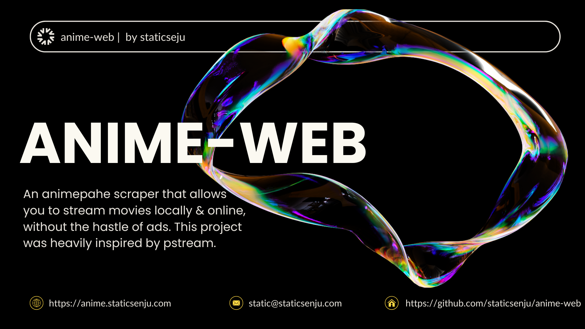

# anime-web

A lightweight web app to search, browse, and stream anime with HLS playback, audio/resolution selection, episode cards with snapshots, continue-watching history, and optional transmux fallback via ffmpeg.



## Features

- Home screen with search and “Continue watching”
- Card-based search results with poster hover overlay
- Player with per-episode Audio/Resolution options
- Episode grid with thumbnails and filler badges
- Skip fillers toggle and autoplay next episode
- Local “continue watching” history with resume
- Image proxy to avoid ORB (OpaqueResponseBlocking)
- Fast-start transmux fallback using ffmpeg when needed

## Requirements

- Node.js 18+ (fetch is built-in from Node 18)
- ffmpeg (installed and available in PATH)
- macOS, Linux, or Windows

## Quick Start

1) Clone the repo
```bash
git clone https://github.com/staticsenju/anime-web.git
cd anime-web
```

2) Install server dependencies
```bash
npm install express cheerio
```

3) Run the server
```bash
# macOS/Linux
PORT=3001 node server.js

# Windows (CMD)
set PORT=3001 && node server.js

# Windows (PowerShell)
$env:PORT=3001; node server.js
```

4) Open the app

Visit:
```
http://localhost:3001
```

## How it works

- The client uses Hls.js to play HLS playlists directly.
- If the stream exposes an audio codec your browser cannot append (e.g., AAC Main), the app switches to an “event” HLS transmux made by ffmpeg (copy video, AAC LC audio) and begins playback after a few segments are ready.
- The server waits for a small buffer of segments before redirecting to the transmuxed master playlist to avoid “plays only one segment” stalls.

## Configuration

Environment variables:
- PORT: HTTP server port (default: 3001)
- PREPARE_MIN_SEGMENTS: Minimum media segments to prepare before starting event playback (default: 6)

FFmpeg:
- Must be installed and available in PATH.
- Used to create a same-origin HLS (fMP4) when fallback is necessary.

## Troubleshooting

- Takes too long at “preparing video”:
  - Make sure you’re not using a full prebuild flow; use the event transmux that starts after a few segments.
  - Ensure ffmpeg is on PATH and your disk/network isn’t saturated.
  - Reduce segment size (hls_time ~2–3s) if you need faster initial buffer.

- OpaqueResponseBlocking on images:
  - The app proxies external images via `/img`. Use that path for posters/snapshots to avoid ORB.

- Language not switching:
  - The player selects the desired audio track when the manifest is parsed; if the variant doesn’t expose alternate audio tracks, the app restarts the source with the selected audio preference.

## Project Structure

```
server.js           # Express server, proxy, transmux control
public/index.html   # UI, Hls.js player, search, episode cards, history
```

## Scripts (optional)

If you prefer npm scripts, you can add these to a package.json:

```json
{
  "name": "anime-web",
  "version": "1.0.0",
  "private": true,
  "type": "module",
  "scripts": {
    "start": "node server.js",
    "dev": "PORT=3001 node server.js"
  },
  "dependencies": {
    "cheerio": "^1.0.0",
    "express": "^4.19.0"
  }
}
```

Then run:
```bash
npm install
npm run dev
```

## Roadmap / TODO

- [ ] Make movies load faster
  - Prefer direct HLS; only fallback to ffmpeg when required
  - Tune segment duration and prebuffer threshold
  - Optional “preload more” without full VOD build
- [ ] Accounts
  - User auth (OAuth/email), per-user preferences
  - Sync continue-watching across devices
- [ ] Settings
  - Default audio/resolution, default skip-fillers state
  - Player options (buffer length, ABR limits)
- [ ] Low-end device presets
  - Toggle low-latency off, limit max resolution/bitrate
  - Reduce buffer and worker load in Hls.js
- [ ] More robust continue watching system
  - Server-side history with timestamps
  - Resume prompts across devices
  - Episode completion detection and next-episode suggestions

## License

MIT
